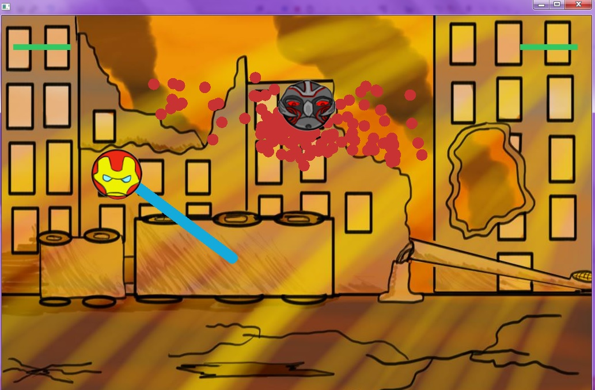
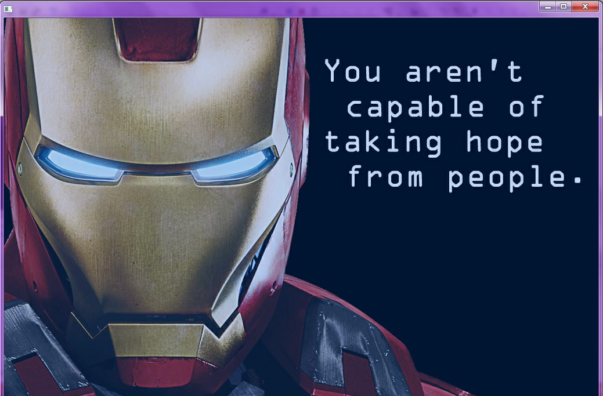
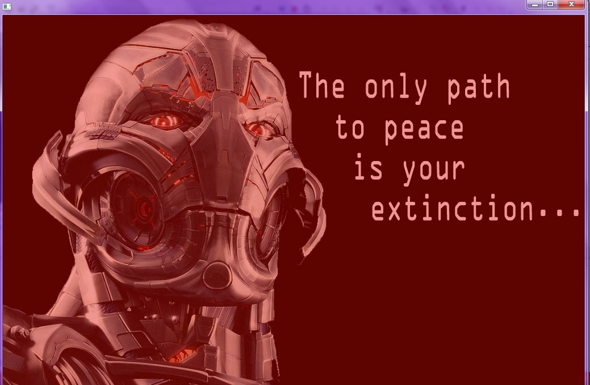

##Iron Man vs Ultron
Iron Man and Ultron are property of Marvel. The art for this app was done by the coder. This has all been used for educational purposes.

In this app, the user plays Iron Man in a battle against Ultron.

After starting the app, the player will see Ultron flying around the sky with a cloud of red dots following him. On the top of the screen to either side are two green bars, representing the health of each character (Iron Man on the left and Ultron on the right). On the ground sits Iron Man, whom the player can control with the arrow keys (Left to go left, Right to go right, and Up to fly). Use the space bar to give Iron Man his weapon beam, and use this to hit Ultron to make his health go down. Be careful, however, to not let Iron Man touch too many of Ultron's cloud particles, or his health will diminish. The first to reach zero health loses.

